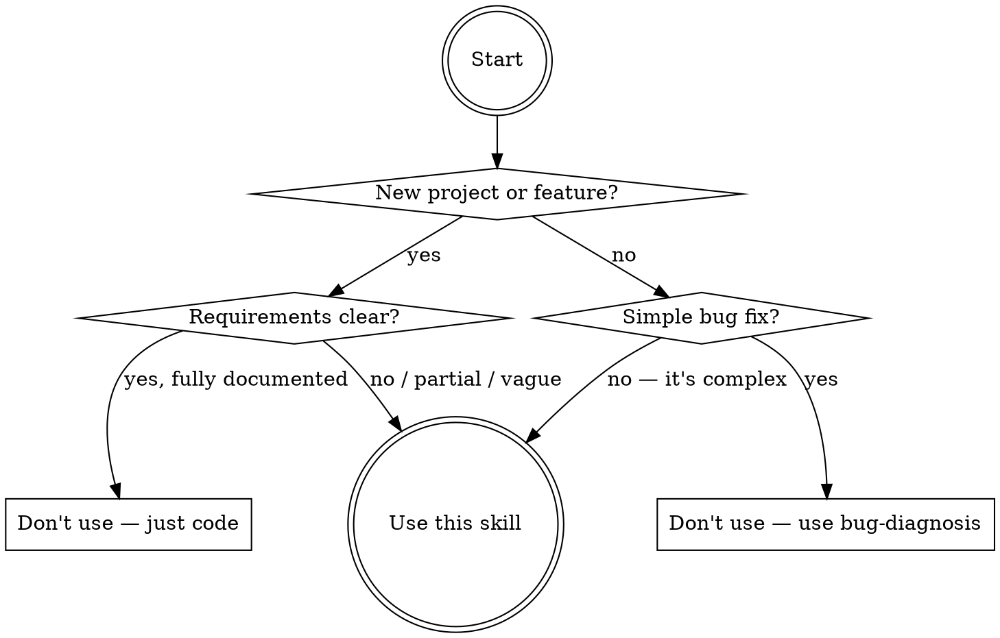

# Planning with Discovery

## Overview

Structured requirements discovery through iterative Q&A, then spec planning with dependency analysis — optionally followed by multi-agent development execution with automated code review.

**Core principle:** Never start coding without a validated plan.

## When to Use



- Requirements are vague, incomplete, or just a rough idea
- Team needs alignment before implementation
- User says "plan", "spec", "think through", "design doc"

**Do NOT use:** Simple bug fixes, fully documented requirements, user says "just do it."

## Quick Reference

| Phase | What | Key Output | Gate |
|-------|------|------------|------|
| 0 | Initialization | Topic name, language, output dir | — |
| 1 | Discovery Q&A | 8 questions/round × N rounds | User says "ready" |
| 2.1 | Master Plan | `master-plan.md` | User approves |
| 2.2 | Config | Spec count + TODO preference | User chooses |
| 2.3 | Spec Files | `specs/01-*.md` ... | Each approved sequentially |
| 2.4 | TODOs | `todos/01-*.md` with dependency metadata | Batch approved |
| 2.5 | Orchestration | `task-orchestration.md` | User approves |
| 3 | Decision | Start development? | User chooses |
| 4 | Team Assembly | Team profile + subagent briefs → spawn via `Agent` tool | User approves |
| 5 | Dev + Review | Subagents code → auto-spawn review subagents → fix issues | Phase-gated, auto |

**Output directory:** `docs/plans/<topic-name>/` — contains `master-plan.md`, `task-orchestration.md`, `specs/*.md`, and optionally `todos/*.md`. Phase 4-5 generates source code in the project's own directories outside `docs/plans/`.

---

## Phase 0: Initialization

1. Read the user's initial task description
2. Auto-generate a kebab-case topic name (e.g., `user-auth-system`)
3. Ask language preference: English or Chinese (or other)
4. Confirm output directory: `docs/plans/<topic-name>/`

## Phase 1: Requirements Discovery

Iterative Q&A rounds until requirements are clear.

**Each round:**
1. Prepare exactly **8 questions**, each with **4 candidate answers**
2. Deliver via **8 `AskUserQuestion` calls** (one per question, each with 4 candidate answers), issued in **two batches of 4** for a natural conversational pace
   - Tool automatically appends "Other" for free-text (5 total choices per question)
3. Digest answers, update understanding

**After each round:**
- Enough info gathered → ask: "Ready to start writing the plan, or another round?"
- Significant gaps → proceed with another round
- User can override anytime with "start writing", "generate plan", etc.

**Question rules:**
- Agent-driven — ask what matters most based on all context so far
- No repeats from previous rounds
- Go deeper (not wider) as rounds progress
- Cover functional, non-functional, risks, edge cases naturally

**Candidate answer rules:**
- Exactly 4 options per question (5th "Other" is automatic)
- Span a spectrum: conservative → ambitious, simple → complex, standard → custom
- Mutually distinct, concise, contextually grounded
- No "I don't know" options — that's what "Other" covers
- Use concrete named approaches, not "Option A"

## Phase 2: Spec Writing

Sequential writing with user approval at each step.

### 2.1: Master Plan

Write `master-plan.md`: overview, goals, scope (in/out), architecture, design decisions, dependencies, risks, TOC linking to spec files.

Present → user approves → proceed. Revise until approved.

### 2.2: Planning Configuration

Two `AskUserQuestion` calls:

1. **Spec file count:**
   - Option 1: `"N files (Recommended)"` — agent's recommendation with rationale
   - Option 2: `"1-3 files (Compact)"`
   - Option 3: `"4-7 files (Balanced)"`
   - Option 4: `"8-10 files (Comprehensive)"`

2. **TODO preference:**
   - Option 1: `"Yes, full TODO files with dependency analysis"`
   - Option 2: `"Yes, lightweight TODOs (checklists only, no dependency metadata)"`
   - Option 3: `"No, specs only — I'll plan tasks myself"`
   - Option 4: `"Let me decide per-spec after reviewing them"`

### 2.3: Detailed Spec Files

Create `specs/01-<name>.md`, `specs/02-<name>.md`, etc. For EACH file sequentially:

1. Write using natural language, pseudo-code, mermaid diagrams — **no real code**
2. Present → user approves → next file. Revise until approved.

Each spec: self-contained, one aspect/module, describes interfaces and behavior (not implementation).

### 2.4: TODO Files with Dependencies (Conditional)

Skip to 2.5 if user chose Option 3 ("No, specs only"). Task Orchestration is always generated regardless.

If user chose Option 4 ("Let me decide per-spec"), ask per spec file whether to generate a TODO for it.

Create `todos/01-<name>.md` per spec. Each TODO file contains:
- Reference to corresponding spec
- `- [ ]` task checklist ordered by implementation sequence

**If user chose Option 1 ("full TODO files")**, also include:
- **`## Dependencies` section at top:**
  - `depends_on: [01, 03]` — which TODOs must complete first
  - `blocks: [04, 05]` — which TODOs wait on this one
  - `parallel_group: A` — same letter = can run in parallel
  - Brief explanation of WHY each dependency exists

**If user chose Option 2 ("lightweight TODOs")**, omit dependency metadata. The orchestration file (Step 2.5) will derive dependencies from spec relationships instead.

Present ALL as batch → user approves. Revise until approved.

### 2.5: Task Orchestration File

Generate `task-orchestration.md`. See [orchestration-guide.md](orchestration-guide.md) for detailed section specs.

**5 required sections:**

| Section | Content |
|---------|---------|
| 1. Dependency Graph | Mermaid `graph TD`, nodes = tasks, edges = dependencies, color by parallel group |
| 2. Execution Phases | Phase 1 (no deps) → Phase 2 (depends on Phase 1) → Phase N. Max 5-7 concurrent agents |
| 3. Critical Path | Longest dependency chain, bottleneck tasks highlighted |
| 4. Agent Assignments | Recommended agent count, task-to-agent mapping, coordination notes |
| 5. Context Files | Required reading list per agent (all planning docs + focused files) |

**Without TODOs:** Derive task units and dependencies from spec modules and master plan. Orchestration file becomes the SOLE dependency source.

Present → user approves. Revise until approved.

## Phase 3: Development Decision

Present summary of all generated files, then ask via `AskUserQuestion`:

**If TODOs WERE generated:**
- Option 1: `"Yes, assemble a development team and start coding"`
- Option 2: `"Not now, I'll start development later"`
- Option 3: `"I want to revisit some parts of the plan first"`
- Option 4: `"Export the plan and share with my team"`

**If TODOs were NOT generated:**
- Option 1: `"Yes, assemble a development team and start coding"` (warn: TODOs recommended)
- Option 2: `"Generate TODO files first, then decide"`
- Option 3: `"Not now, I'll start development later"`
- Option 4: `"I want to revisit some parts of the plan first"`

## Phase 4: Development Team Assembly — Launching Subagents

This phase spawns real subagents (via the `Agent` tool) to form a development team. Each subagent is an independent coding agent that reads planning docs, writes code, and reports back.

### 4.1: Team Role Selection

**This step is mandatory.** Before any subagent is created, the user MUST choose a team profile. Ask via `AskUserQuestion` — see [team-profiles.md](team-profiles.md) for full persona details and prompt prefixes:

- Option 1: **`"Google Core Engineering Team"`** (Default) — scalable systems, clean architecture, testing culture
- Option 2: **`"DeepMind AI/ML Engineering Team"`** — ML pipelines, algorithm design, research-to-prod
- Option 3: **`"Meta Infrastructure & Product Team"`** — distributed systems, React, rapid iteration
- Option 4: **`"Stripe Developer Platform Team"`** — API excellence, security-first, bulletproof error handling

"Other" → user provides custom team persona (used verbatim). The selected profile determines the persona prompt injected into every subagent in Phase 4-5.

### 4.2: Team Composition & Assignment Plan

Analyze `task-orchestration.md` Section 4. For each subagent, prepare an assignment brief — see [orchestration-guide.md](orchestration-guide.md) for the brief template. Brief includes: identity, assigned tasks, dependencies, parallel peers, required reading, coordination notes, completion criteria.

Present the full team composition (number of subagents, names, task mapping, execution phases) → user approves before any subagent is launched.

### 4.3: Launch Development Subagents

**Use the `Agent` tool to spawn each development subagent.** Each subagent runs independently and writes real code.

**Launching rules:**
- **Execution Phase 1 subagents**: Launch ALL in parallel using multiple `Agent` tool calls in a single message (they have no dependencies)
- **Execution Phase 2+ subagents**: Launch ONLY after all their dependency tasks from previous phases have completed AND passed code review (Phase 5.1)
- Set `run_in_background: true` for parallel subagents so they execute concurrently

**Each subagent prompt MUST include** — see [orchestration-guide.md](orchestration-guide.md) for the full template:
- The team persona description from Step 4.1 (e.g., "You are a senior Google engineer...")
- Explicit instruction: **"BEFORE writing any code, use the Read tool to read ALL of these planning documents:"** followed by the full file path list
- Specific task assignment and completion criteria
- Dependency info: what was already completed, what depends on this subagent's output
- **"When you finish, report what files you created/modified and what you implemented. Do NOT consider your work final — a code review subagent will review and fix issues."**

**Monitoring:**
- Track which subagents have completed via their return messages
- When all subagents in an execution phase complete → trigger Phase 5.1 code review for each
- Report progress to the user at each phase transition
- Launch next-phase subagents only after current phase is fully reviewed

**On subagent failure:** Ask user via `AskUserQuestion` — retry / reassign / skip / abort. See [orchestration-guide.md](orchestration-guide.md) for details.

## Phase 5: Automated Code Review & Quality Assurance

**Code review is fully automated — no user action needed.** The orchestrator automatically spawns review subagents after each dev subagent completes.

### 5.1: Per-Agent Code Review (Auto-triggered)

**Immediately** when a development subagent reports completion, **automatically** spawn a Code Review subagent using the `Agent` tool:

```
Agent(
  description: "Code review for {agent-name}",
  prompt: {review prompt from orchestration-guide.md Code Review Agent Template},
  mode: "auto"
)
```

The review subagent:
1. Reads ALL planning documents (master plan, specs, TODOs, orchestration file)
2. Reads all files created/modified by the dev subagent
3. Reviews against this checklist:
   - **Correctness:** Implementation matches spec
   - **Code quality:** Clean code, proper naming, no smells
   - **Security:** No OWASP top 10 vulnerabilities introduced
   - **Testing:** Adequate and meaningful tests
   - **Integration:** Compatible with other agents' code
   - **TODO compliance:** All checklist items addressed
4. **If issues found → fixes them directly** (edits the code), then reports what was changed and why
5. **If no issues → confirms pass**

See [orchestration-guide.md](orchestration-guide.md) for the full review prompt template.

**This happens automatically for EVERY dev subagent** — do NOT wait for user input, do NOT skip, do NOT ask whether to review. The review subagent is always spawned.

### 5.2: Integration Verification

After ALL subagents in an execution phase have completed AND their review subagents have confirmed pass:

1. Run available test suites via `Bash` (`npm test`, `pytest`, `go test`, etc.)
2. If tests fail → automatically spawn a fix subagent (same team persona) with the test output → re-review → re-test
3. Report phase status to user before launching next-phase subagents

### 5.3: Final Completion

After all phases complete, present summary (tasks, reviews, tests, files modified). Ask via `AskUserQuestion`:

- Option 1: `"Proceed to commit/PR creation"`
- Option 2: `"Run additional verification or testing"`
- Option 3: `"I want to make manual adjustments first"`
- Option 4: `"End session, I'll handle the rest manually"`

---

## Common Mistakes

| Mistake | Fix |
|---------|-----|
| Writing spec before user agrees to begin | Wait for explicit readiness signal |
| Real code in planning phases (0-2) | Pseudo-code and mermaid diagrams only |
| Skipping approval on any spec file | Each spec must be approved before the next |
| ≠ 8 questions per round or ≠ 4 options each | Always exactly 8 questions × 4 candidates |
| Generic/overlapping candidate answers | Span a spectrum of distinct, specific options |
| Full TODO files missing dependency annotations | Include `depends_on`, `blocks`, `parallel_group` unless user chose lightweight |
| Skipping orchestration file | Always generate `task-orchestration.md` |
| Launching dev subagents without user approval | User must approve team composition in Step 4.2 first |
| Launching Phase N+1 before Phase N passes review | Phase-gated: complete + reviewed + tested |
| Dev subagents skip reading planning docs | ALL planning docs required reading before coding |
| Waiting for user input before code review | Code review subagents are AUTO-spawned, no user action |
| Not using `Agent` tool to spawn subagents | Phase 4-5 MUST use `Agent` tool, not just describe tasks |
| Skipping team selection (Step 4.1) | ALWAYS ask user to choose team profile before spawning |
| Starting development without user consent | User explicitly chooses in Phase 3 |

## Required Tools

- `Read`, `Write`, `Edit` — file operations
- `Glob`, `Grep` — project exploration
- `AskUserQuestion` — structured choices (4 options, tool adds 5th "Other")
- `Bash` — creating directories, running test suites
- **`Agent`** — spawning development and code review subagents (Phase 4-5). Use `run_in_background: true` for parallel subagents within the same execution phase

Phase 0-2 works in any environment. Phase 4-5 requires the `Agent` tool for subagent spawning.
